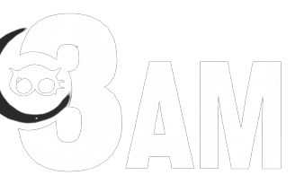

# COSC 360 Project (MyDiscussionForumWebsite)

---

 
**Project Description and details:**

> **3AM** is a website that is specifically designed for night people who wish to connect with others and talk about their thoughts at midnight.
> The website will provide a platform for users to engage in discussions, share their experiences and ideas, and connect with like-minded individuals. 
> Moreover, 3AM discussion forum allows registered users to engage in online discussions and unregistered users to only view these discussions. 
> The website will have features like popular forums such as Reddit. 

---

**3AM** Features:

* User side
    * Browse and view discussions without registering
    * Search for posts by keyword without registering
    * View popular posts and liking posts for logged in users
    * Register at the site by providing their username, e-mail, password, and profile picture
    * Login using username and password
    * Create and comment on discussions when logged into the site
    * Users are required to be able to view/edit their profile
    * Inappropriate post can be reported by logged in users and will be reviewed by admins

* Admin side
    * Add/remove user
    * Edit/remove posts
    * Search user using their information (email or username or post)
    * Create/remove to-do list tasks
    * Reiview reported posts
 
 ---
 Client side experience report

* [Click here for PDF](DOCS/Client-side%20experience.pdf)

 ---
 Minimal core functionality report

* [Click here for PDF](DOCS/Minimal%20Core%20Functionality.pdf)

 ---
 3AM user guide

* [Click here for PDF](DOCS/3AM%20User%20Guide.pdf)

 ---
 System implementation from a developer's perspective

* [Click here for PDF](DOCS/System%20Implementation.pdf)

